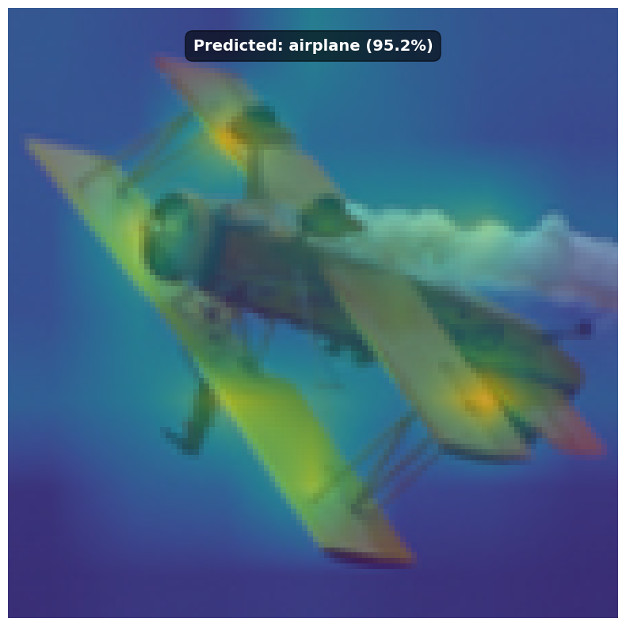

# ViT (Vision Transformer) - Initial Implementation & Playground

**⚠️ Deprecation & Active Development Notice ⚠️**

This repository contains an initial implementation of the Vision Transformer (ViT) model, primarily developed for learning purposes and experimentation.

**Active development, including Self-Supervised Learning (SSL) pre-training methods (SimMIM, DINO, etc.), advanced features, and more robust training, has been moved to a new, dedicated repository:**

 **https://github.com/kristi700/ViT-SSL**

Please refer to the new repository for the latest code, more comprehensive experiments, and future updates. This current version in the "playgrounds" folder will no longer be actively maintained.

---

## Project Overview

This project was an initial exploration into implementing the Vision Transformer (ViT) architecture from the paper "An Image is Worth 16x16 Words: Transformers for Image Recognition at Scale."

The primary goals here were to:
*   Understand the core components of ViT:
    *   Patch Embedding (Convolutional and Manual)
    *   Transformer Encoder Blocks (Multi-Head Self-Attention, Feed-Forward Networks, LayerNorm)
    *   CLS Token and Positional Embeddings
    *   MLP Head for classification
*   Set up a basic training and evaluation pipeline.
*   Experiment with visualizing attention maps.

## Implementation Details

*   **Framework:** PyTorch
*   **Model Components:**
    *   `ConvolutionalPatchEmbedder`: Includes CLS token and learnable 1D positional embeddings.
    *   `EncoderBlock`: Standard Transformer encoder block with Pre-LayerNorm.
    *   `MLPHead`: Simple linear layer (with LayerNorm) for classification.
*   **Dataset:** Primarily tested with STL-10.
*   **Training:** Trained **from scratch** (no pre-trained ImageNet weights were used for this playground version).

## Results & Observations (STL-10 from Scratch)

When training this ViT implementation from scratch on the labeled portion of the STL-10 dataset (using a 0.2 validation split), the model achieved approximately **80.6% validation accuracy** after 100 epochs.

**Note:** Training ViTs from scratch on smaller datasets like STL-10 is challenging and typically requires extensive data augmentation, longer training schedules, and careful hyperparameter tuning to achieve state-of-the-art results. The performance here reflects a more basic from-scratch training setup. The new repository linked above will explore more advanced training techniques, including self-supervised pre-training to improve performance.

## Attention Visualization Examples

Here are a couple of examples showcasing the CLS token's attention on test images from the STL-10 dataset. This visualization overlays the averaged attention map from the last Transformer encoder block onto the original image. The text indicates the model's prediction.

  
  

## Code Structure

*   `vit_core/`: Contains the core modules (attention, encoder_block, mlp_head, patch_embedding, vit).
*   `scripts/` (or `train.py`, `test.py`): Training, evaluation, and visualization scripts.
*   `configs/`: YAML configuration files for training.
*   `data/`: Dataset handling (though this playground version might directly use a simplified setup).